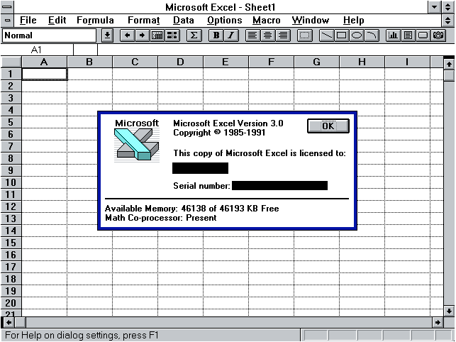
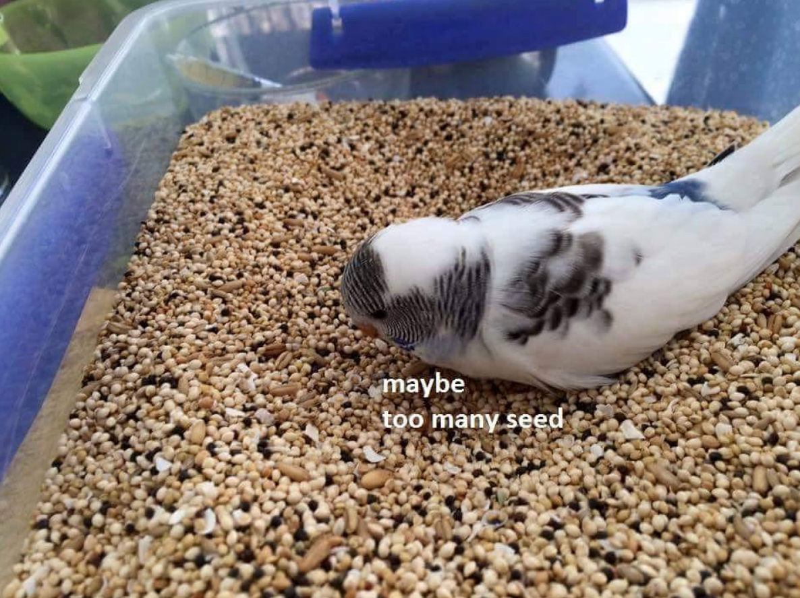
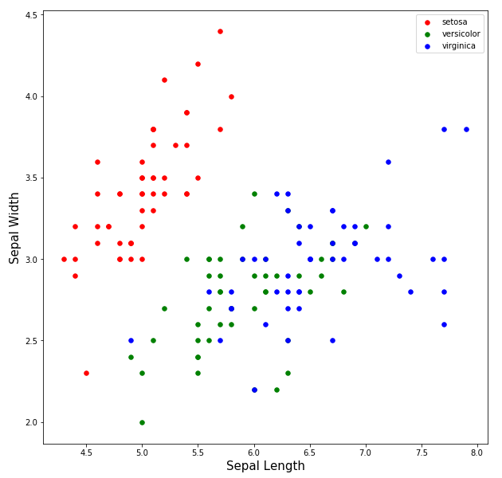
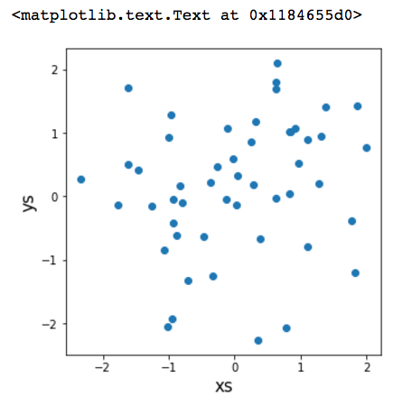

footer: Python and Data Science
slidenumbers: true

# [fit] Taste of Python

## and

# [fit] Data Science

Galvanize, March 9 2018

---

# [fit] What is data science?

---

# What is data science?

# [fit] Pursuit of truth for fun and profit!

Seriously...

---

VisiCalc circa 1979 [^1]


[^1]: [Visicalc on Wikipedia](https://en.wikipedia.org/wiki/VisiCalc)

---

MS Excel circa 1991 [^2]



[^2]: [Tech Flashback: Microsoft Excel for Windows Version 3.0](http://goughlui.com/2014/05/31/tech-flashback-microsoft-excel-for-windows-version-3-0/)

---

But our data needs have grown...



---

# What is data science?

+ We are in an unprecedented period of data growth.

+ Data by itself is usually not useful for actionable insight--and few people know how to create that insight.

+ Data science (DS) is where we can systematically pursue insights from data.

+ Part software engineering and part mathematics. Or the other way around...

---

# What is data science?

Not mutually exclusive.

+ Data visualization: charts, graphs, dashboards.

+ Data engineering: Handling large amounts of data at high speed. Example: credit card fraud detection.

+ Predictive modeling: Make model to use predictors to forecast future results. Example: online merchants and purchase suggestions.

+ Math: Statistics, calculus, algorithms, etc.

---

# First, a spoiler alert...

# [fit] Our end goal

---

# Irises


Irises come in many different types. [^3] Even though I can't distinguish them, computers can be trained to do the same. This is called **supervised** learning, where we have truth to show the computer.

[^3]: [Iris Plant](https://en.wikipedia.org/wiki/Iris_(plant))

---

# Iris dataset [^4]



Train a model of logistic regression to distinguish among Iris types based on 4 attributes:

+ Sepal length and width

+ Petal length and width

[^4]: [Iris data set](https://en.wikipedia.org/wiki/Iris_flower_data_set)

---

# Tonight's topics: Part 1

A little bit of Python

+ I will show slides, then...

+ We will both code along together in Jupyter

---

# Tonight's topics: Part 2

I will do a demo of a little data science workflow.

+ Load the Iris data set

+ Explore the data set in various ways.

+ Train and test a **logistic regression** model to determine Iris types.

---

# [fit] Python Essentials

A not-too-comprehensive list

---

# The essentials

+ `print`: Displays output in the notebooks.

+ Variables: Like math variables they hold values. They can hold numbers or quoted words.

+ Lists: hold multiple values in a collection.

+ `import`: Grabs software for use in our notebooks.

+ matplotlib: One tool for data visualization.

---

# Print statement

Displays output in our notebook. Print a single number:

`print 5`

Print words in quotes (a string)

`print 'Hello World!'`

You can also print variables, coming up next.

---

# [fit] Demo

# `print` statement

---

# Variables

Like variables in math: you can store numbers

```python
x = 12.3
print x
```

You can store words

```python
word = 'petal width'
print word
```

---

# [fit] Demo

# variables

---

# Lists

A list hold a sequence of variables all at once. You make a list of values in square brackets separated by commas. You can print them if they are short enough.

```python
my_lst = [7, 8, 9, 10, 42]
print my_lst
```

---

# Lists

You can access individual variables directly with indexes starting at 0 and ending the length - 1.

```python
my_lst = [7, 8, 9, 10, 42]

print my_lst[0]    # 7
print my_lst[1]    # 8
print my_lst[4]    # 8
```

---

# [fit] Demo

# Lists

---

# `for` loops

`for` loops iterate over every element of a list (and many other data structures) in turn.

This colon and indentation scheme is how Python keeps track of blocks of code that contain multiple lines, and is seen throughout the language.

---

# `for` loops

```python
for x in my_lst:
    print x * 2
```

```
14
16
18
20
84
```

---

# [fit] Demo

# `for` loops

---

# `import` necessary software

We need code we don't write ourselves, so we `import` it.

```python
from numpy import random
```

Then we can make 5 random values

```python
random_numbers = random.rand(5)
print random_numbers
```

`random.rand(5)` is a **function call**, and 5 is the argument which tells NumPy to create 5 values.

---

# [fit] Demo

# `import` of code

---

# Matplotlib

+ Is created to make data visualizations

+ Creates histograms, scatter, line chart, and many more.

First we need to set it up to use in Jupyter

```python
import matplotlib.pyplot as plt
%matplotlib inline
```

---

# Scatter plot: Code

```python
xs = random.normal(0, 1, 50)
ys = random.normal(0, 1, 50)
fig = plt.figure(figsize=(5, 5))
ax = fig.add_subplot(1, 1, 1)
ax.scatter(x=xs, y=ys)
ax.set_xlabel('xs', size=15)
ax.set_ylabel('ys', size=15)
```

normal distributions. means μ=0. standard deviation σ=1. 50 samples

---

# Scatter plot: Result



Try out changing the standard deviation and hit `Shift+Enter` a few times.

```python
xs = random.normal(0, 1, 50)
ys = random.normal(0, 1, 50)
```

```python
xs = random.normal(0, 0.001, 50)
ys = random.normal(0, 0.01, 50)
```

---

# [fit] Demo

# matplotlib

---

# Summary of some Python

+ `print`: Displays output in the notebooks.

+ Variables: Like math variables they hold values. They can hold numbers or quoted words.

+ Lists: hold multiple values in a collection.

+ `import`: Grabs software for use in our notebooks.

+ matplotlib: One tool to make data visualizations.
