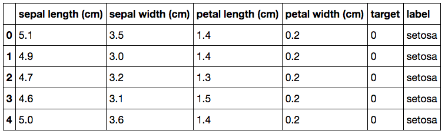
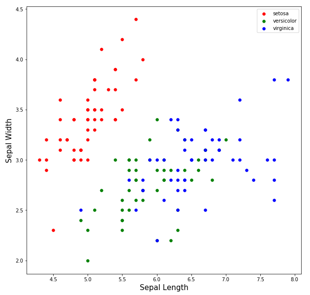
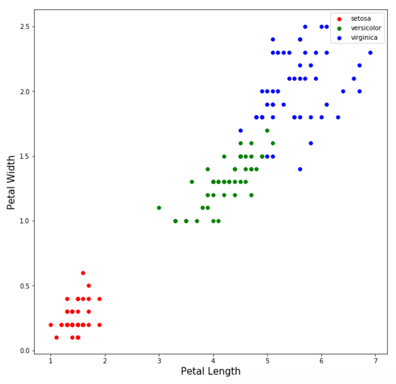

footer: Python and Data Science
slidenumbers: true

# [fit] Data

# [fit] Science

and other data science software

---

# Data science code

+ NumPy: An exceptional numeric computation system. (we have already seen this)

+ matplotlib: A system to make data visualizations.

+ Pandas: An spreadsheet-like way of manipulating data in Python.

+ sklearn: A machine learning system.

---

# NumPy

+ We have already started using it for the random number generation.

+ Used for statistics and liner algebra, among other things.

+ Operates on vectors and matrices.

+ It is made to run math very fast.

+ It is the foundation of a lot of other data science computing code.

---

# [fit] Pandas

---

# Pandas

+ Is like a spreadsheet you can handle with Python

+ 2D data is called a `DataFrame`

+ Think of database column names and row ids, or excel column letters and row numbers.

+ Queries, aggregates, and pivots data.

---

# Categorical and Continuous Variables

+ Classification is used to predict categorical variables.

+ Regression is used to predict continuous variables.

+ In our case, we will use *continous* data (measurements) to assign a *categorical* label of the iris type.

---

# Preparing the Iris data

Import the iris data, and the machine learning code. Finally put the iris data into a variable.

```python
import pandas as pd
from sklearn.datasets import load_iris
from sklearn.linear_model import LogisticRegression
from sklearn.model_selection import train_test_split
iris_data = load_iris()
```

---

## What is in there?

+ `print iris_data.DESCR`: Description of data

+ `print iris_data.target_names`: Types of irises

+ `print iris_data.feature_names`: Feature names we'll use to predict iris types.

+ `print iris_data.target_names[iris_data.target]`: Irises type with each feature.

---

# Pandas to the rescue

```python
target_names = iris_data.target_names[iris_data.target]
iris_df = pd.DataFrame(iris_data.data, columns=iris_data.feature_names)
iris_df['target'] = iris_data.target
iris_df['label'] = target_names
iris_df.tail()
```

---

# Now...a slick table



The `label` is the type of Iris and what we aim to predict. Each label has an integer  `target` that corresponds to the label name.

---

# Visualization black magic

Just for your reference, though you don't need to retype it...

```python
fig = plt.figure(figsize=(10, 10))
ax = fig.add_subplot(1, 1, 1)
for target, color in zip(iris_df.target.unique(), ['r', 'g', 'b']):
    sub_df = iris_df.query('target == @target')
    ax.scatter(x=sub_df['sepal length (cm)'].values, y=sub_df['sepal width (cm)'].values,
               color=color, label=iris_data.target_names[target], s=30)
ax.legend(loc='best')
ax.set_xlabel('Sepal Length', size=15)
ax.set_ylabel('Sepal Width', size=15)
```

---

## Sepal measurements, notice *setosa* clump



---

## Petal measurements, notice *setosa* clump



---

# Wait...

...but aren't we going to have the computer do this?

Yes, but we are doing something called supervised learning. Which means we start with data we already know the labels of (like the iris type here) to train the computer from that known source of truth.

---

# Now the Machine

# [fit] Learns!

about Irises

---

# Logistic Regression

+ Fit a logisitc model that determines irises.

+ Test the model on a single observation where it should predict Setosa as our iris type.

+ Run the model on all known observations and score its accuracy.

---

# Fit the model

+ **X**: matrix of observations on the rows and attributes down the columns.

+ **y**: column separated from X that contains the known labels we will use to train the model.

```python
X = iris_df[['sepal length (cm)', 'sepal width (cm)', 'petal length (cm)', 'petal width (cm)']].values
y = iris_df['label'].values
logistic_model = LogisticRegression()
logistic_model.fit(X, y)
```

---

# How well does it do?

```python
print 'Model guess for a setosa: {}'.format(logistic_model.predict(np.array([[4.5, 3.3, 1.6, 0.2]]))[0])
print 'Score {}'.format(logistic_model.score(X, y))
```

```
Model guess for a setosa: setosa
Score 0.96
```

---

# [fit] Finishing up

+ Learned some Python basics: `print`, variables, lists, importing modules of

+ Made some data visualizations of random numbers and Iris measurements

+ Trained and tested a logistic model on the Iris data.
